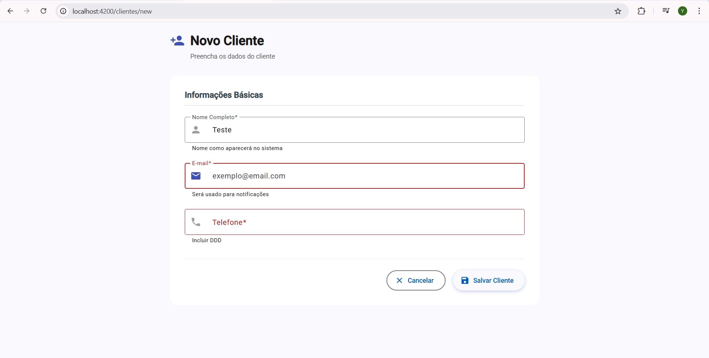
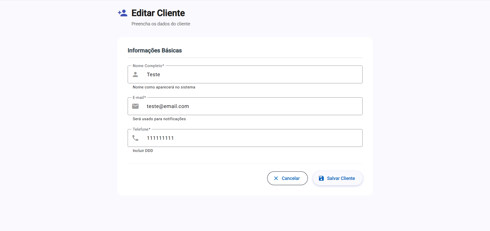

Sistema de Gerenciamento de Clientes
Sistema full-stack para gerenciamento de clientes com Node.js/Express, Angular 20 e Supabase.
🚀 Tecnologias
Backend: Node.js, Express, Supabase, CORS, dotenv
Frontend: Angular 20, Angular Material, TypeScript, RxJS
📦 Pré-requisitos

Node.js 18+
Angular CLI 20
Conta no Supabase

💾 Instalação
Backend
cd backend
npm install
Dependências:

express
cors
@supabase/supabase-js
dotenv

Frontend
cd frontend
npm install
Dependências:

@angular/core, @angular/material, @angular/cdk, @angular/animations (v20)

⚙️ Configuração
Backend - Arquivo .env

PORT=3000
SUPABASE_URL=sua-url-do-supabase
SUPABASE_KEY=sua-chave-do-supabase

Criar Tabela no Supabase com as colunas nome, email e telefone

🎮 Executar
Backend:
cd backend/src
node server.js
Servidor: http://localhost:3000
Frontend:
cd frontend
ng serve
Aplicação: http://localhost:4200
🔌 API Endpoints
Base URL: http://localhost:3000/api/clientes

GET / - Listar todos
GET /:id - Buscar por ID
POST / - Criar cliente
PUT /:id - Atualizar cliente
DELETE /:id - Deletar cliente

📸 Screenshots

Tela inicial do sistema:

Adicionar cliente:

Editar cliente:

